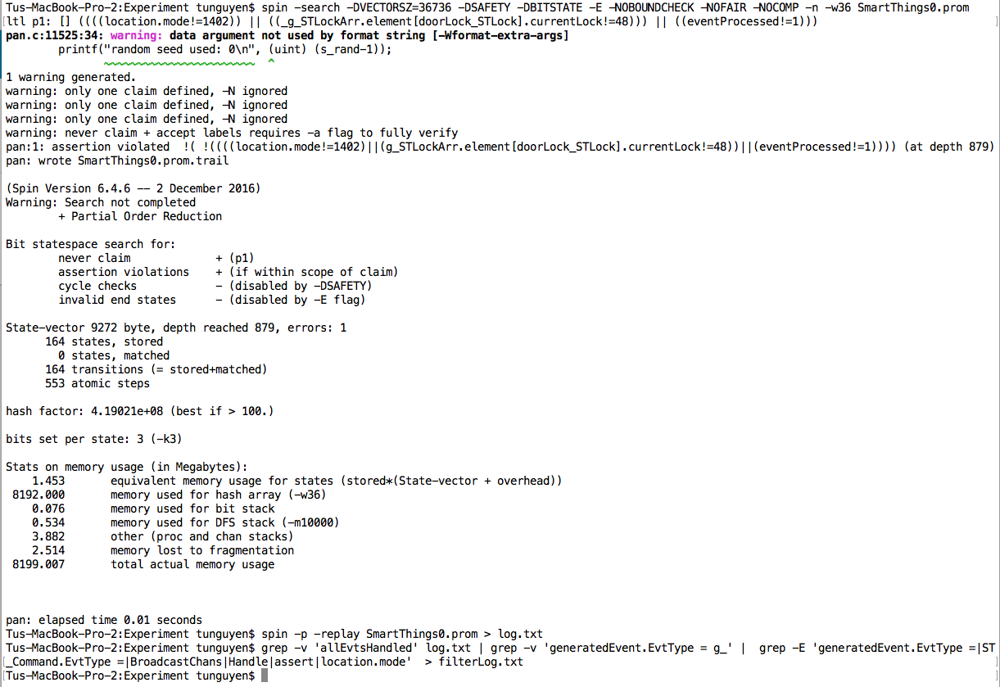

# Overview

In this repository you will find the detailed technical report and protype code of IoTSan, a model-checking-based tool used to verify the safety of IoT systems.

This work was accepted and will be published at *The 14th International Conference on emerging Networking EXperiments and Technologies (CoNEXT '18)*.

# Code Structure

IoTSan is developed based on [Bandera](http://bandera.projects.cs.ksu.edu/) and its code structure is as following:
1. The "*App Dependency Analyzer*" module and "*Translator*" (Groovy to Java) module are at "IoTSan/src/edu/ksu/cis/bandera/jjjc/gparser/"
2. The "*Model Generator*" module is at "IoTSan/src/edu/ksu/cis/bandera/spin/"
3. The "*Configuration Extractor*" module is at "IoTSan/src/configextractor" (This module is not yet integrated into IoTSan at this initial version).

**Note**: This is the initial version of IoTSan, which does not include all of the modules mentioned in the paper. I will update this repository with additional modules.

# Using The Tool

1. Create an Eclipse project and clone this repository (you can find the instructions [here](https://github.com/collab-uniba/socialcde4eclipse/wiki/How-to-import-a-GitHub-project-into-Eclipse)).

2. Create the folder "input/smartapps" at the root directory of your porject. You then need to put the source code of apps and their configuration files in this folder. Note that you should give good names to app files since they will become the names of apps in the resulting modeled system.

3. Run the "IotSan.java" as "Java Application". The resulting Promela model code will be generated and stored at ".../IoTSan/output/IotSanOutput/birc".

4. Append the safety property in LTL format to the end of each output file.

5. Run the verification with SPIN using the following command in a terminal: 
`spin -search -DVECTORSZ=36736 -DSAFETY -DBITSTATE -E -NOBOUNDCHECK -NOFAIR -NOCOMP -n -w36 <Promela file>`. 
For example: 
`spin -search -DVECTORSZ=36736 -DSAFETY -DBITSTATE -E -NOBOUNDCHECK -NOFAIR -NOCOMP -n -w36 SmartThing0.prom`

6. If any violation is detected, the file "SmartThing0.prom.trail" will be created by SPIN. Use the following command to get counter-example log: `spin -p -replay SmartThings0.prom > log.txt`

7. Get a filtered logs by using: 
`grep -v 'allEvtsHandled' log.txt | grep -v 'generatedEvent.EvtType = g_' |  grep -E 'generatedEvent.EvtType =|ST_Command.EvtType =|BroadcastChans|Handle|assert|location.mode'  > filterLog.txt`

Note that you need to install SPIN by following instructions [here](http://spinroot.com/spin/whatispin.html) before using this tool.

# Samples

Please refer to the directory "*IoTSan/samples/*" for examples of app source code, config files, and log files.

Here is the snapshot of a verification run:

# Citation
If you use the source code, please cite the following paper:

Dang Tu Nguyen, Chengyu Song, Zhiyun Qian, Srikanth V. Krishnamurthy, Edward J. M. Colbert, and Patrick McDaniel, "*IotSan: Fortifying the Safety of IoT Systems*," In Proc. of the 14th International Conference on emerging Networking EXperiments and Technologies (CoNEXT '18)
